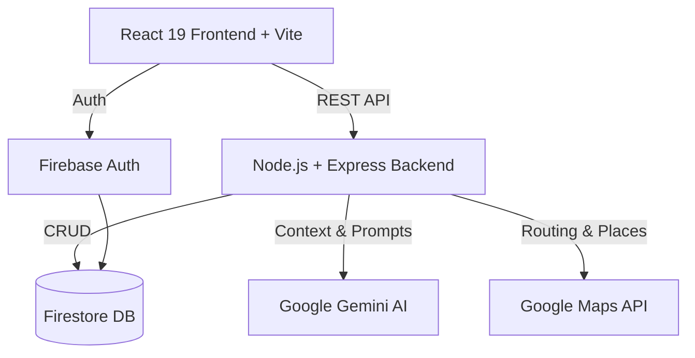

<div align="center">

# 🌍 WANDERSYNC AI

**The Ultimate AI-Powered Travel Operating System**

[](https://react.dev/)
[](https://nodejs.org/)
[](https://firebase.google.com/)
[](https://deepmind.google/technologies/gemini/)

*Created by Team BRAINGPT for the GLOBAL BUILDATHON*

</div>

---

## 📖 Introduction

**WANDERSYNC AI** is a luxury, AI-native Travel Operating System built for modern global travelers with an India-first intelligence core. 

### Project Vision
To eliminate the fragmentation of travel planning by consolidating discovery, budgeting, routing, and real-time assistance into one beautiful, intelligent, and seamless platform.

### Problem Statement
Travelers currently juggle 5-7 different apps (booking, maps, expense trackers, notes, AI chats) just to manage a single trip. This disjointed experience leads to stress, budget overruns, and missed opportunities.

### Solution Overview
WANDERSYNC AI acts as a digital concierge. From the moment you decide to travel, our multi-agent Gemini AI system plans your itinerary, Google Maps optimizes your routes, and our integrated financial engine tracks your expenses in real-time.

### Hackathon Theme Alignment
We leverage state-of-the-art Generative AI (Google Gemini) and highly scalable infrastructure (Firebase + Google Cloud) to solve a universal consumer problem, demonstrating innovation, technical depth, and immense market potential.

---

## 🧠 Team BRAINGPT

We are a collective of product-obsessed engineers, designers, and AI enthusiasts.

- **Our Mission:** To build software that feels like magic.
- **Core Values:** User Experience First, Uncompromising Quality, Deep AI Integration, and Accessible Design.
- **Innovation Goals:** To push the boundaries of what React 19 and Gemini AI can achieve together in a browser environment.

---

## 🏛 Architecture Overview

WANDERSYNC AI employs a modern decoupled architecture:



- **Frontend:** React 19 (JavaScript), Vite, Tailwind CSS v4, Framer Motion, Zustand.
- **Backend:** Node.js, Express.js, Firebase Admin SDK.
- **Database:** Google Cloud Firestore (NoSQL).
- **Authentication:** Firebase Auth (Email/Google).
- **AI Layer:** Google Gemini (Multi-Agent System for budgeting, planning, and concierge).
- **Maps Layer:** Google Maps Platform (Places, Directions, Geocoding).
- **Deployment:** Vercel/Firebase Hosting (Frontend) + Google Cloud Run (Backend).

---

## ⚙️ Prerequisites

Before you begin, ensure you have the following installed:

- **Node.js:** `v20.x` or higher (LTS recommended)
- **npm:** `v10.x` or higher
- **Git:** `v2.x` or higher
- **Firebase CLI:** `npm install -g firebase-tools`
- **Google Cloud SDK:** [Download Here](https://cloud.google.com/sdk/docs/install)
- **Recommended IDE:** Visual Studio Code
- **Required VS Code Extensions:**
  - ESLint
  - Prettier - Code formatter
  - Tailwind CSS IntelliSense

---

## 🚀 Repository Setup

Follow these steps to get the project running locally.

```bash
# 1. Clone the repository
git clone https://github.com/braingpt/wandersync-ai.git

# 2. Enter the project directory
cd wandersync-ai

# 3. Install backend dependencies
cd backend-node
npm install

# 4. Install frontend dependencies
cd ../frontend
npm install
```

---

## 💻 Frontend Setup

The frontend is a Vite-powered React 19 application.

### Environment Variables (`frontend/.env`)
Create a `.env` file in the `frontend/` directory:

```env
VITE_API_URL=http://localhost:3000/api/v1
VITE_FIREBASE_API_KEY=your_firebase_api_key
VITE_FIREBASE_AUTH_DOMAIN=your_project_id.firebaseapp.com
VITE_FIREBASE_PROJECT_ID=your_project_id
VITE_GOOGLE_MAPS_API_KEY=your_google_maps_api_key
```

### Commands
```bash
# Start Development Server (Runs on localhost:5173)
npm run dev

# Build for Production
npm run build

# Preview Production Build
npm run preview
```

---

## 🗄 Backend Setup

The backend is a robust Node.js/Express architecture utilizing Firebase Admin.

### Environment Variables (`backend-node/.env`)
Create a `.env` file in the `backend-node/` directory:

```env
PORT=3000
NODE_ENV=development

# Firebase Admin credentials (Path to your service account JSON)
FIREBASE_SERVICE_ACCOUNT_PATH=./config/serviceAccountKey.json
FIREBASE_PROJECT_ID=your_project_id

# APIs
GEMINI_API_KEY=your_gemini_api_key
GOOGLE_MAPS_API_KEY=your_google_maps_api_key

# Security
CORS_ORIGIN=http://localhost:5173
RATE_LIMIT_WINDOW_MS=900000
RATE_LIMIT_MAX_REQUESTS=100
```

### Commands
```bash
# Start Development Server (with Nodemon)
npm run dev

# Start Production Server
npm start
```

---

## 🔥 Firebase Setup

1. **Create Project:** Go to the [Firebase Console](https://console.firebase.google.com/) and create a new project.
2. **Enable Auth:** Navigate to Authentication -> Sign-in method -> Enable Email/Password and Google.
3. **Create Database:** Navigate to Firestore Database -> Create Database (Start in production mode).
4. **Service Account:** Go to Project Settings -> Service Accounts -> Generate new private key. Save this as `serviceAccountKey.json` in `backend-node/config/`.
5. **Security Rules:** Update your Firestore rules to ensure only authenticated users can read/write their own data.

---

## ☁️ Google Cloud Setup

1. Navigate to the [Google Cloud Console](https://console.cloud.google.com/).
2. Select the project created by Firebase.
3. Enable Billing.
4. **Enable APIs:**
   - Maps JavaScript API
   - Places API
   - Directions API
   - Generative Language API (Gemini)
5. **Security:** Restrict your API keys to your specific domains and required APIs.

---

## 🏃 Running Locally

To run the full stack locally, you will need two terminal windows.

**Terminal 1 (Backend):**
```bash
cd backend-node
npm run dev
```
*(Expected output: "🚀 Server running on port 3000")*

**Terminal 2 (Frontend):**
```bash
cd frontend
npm run dev
```
*(Expected output: "Vite server running at http://localhost:5173")*

### Verification
1. Open `http://localhost:5173` in your browser.
2. Create an account via Firebase Auth.
3. Check the network tab to ensure API calls to `http://localhost:3000` are returning 200 OK.

---

## 🧪 Testing

WANDERSYNC AI is built with testability in mind.

```bash
# Frontend Unit Tests (Vitest)
cd frontend
npm run test

# Backend Unit Tests (Jest)
cd backend-node
npm run test

# Test Coverage
npm run test:coverage
```

---

## 🚢 Deployment

### Backend (Google Cloud Run)
We use Docker to containerize the backend and deploy to Cloud Run.
```bash
cd backend-node
gcloud builds submit --tag gcr.io/YOUR_PROJECT_ID/wandersync-backend
gcloud run deploy wandersync-backend --image gcr.io/YOUR_PROJECT_ID/wandersync-backend --platform managed --region us-central1 --allow-unauthenticated
```

### Frontend (Firebase Hosting / Vercel)
Update the `VITE_API_URL` to your Cloud Run URL before building.
```bash
cd frontend
npm run build
firebase deploy --only hosting
```

---

## 📂 Project Structure

```text
wandersync-ai/
├── frontend/                  # React 19 + Vite Application
│   ├── src/
│   │   ├── app/               # Global Router & State Providers
│   │   ├── components/        # Reusable UI components (Navigation, Discovery)
│   │   ├── layouts/           # Root and Page Layouts
│   │   ├── pages/             # Page Views (Landing, Trip, Planner)
│   │   ├── services/          # API Clients and Firebase Setup
│   │   └── store/             # Zustand Global State
│   └── index.css              # Tailwind v4 Configuration & Premium Styles
│
├── backend-node/              # Express + Node.js API
│   ├── src/
│   │   ├── config/            # Firebase Admin & Environment Setup
│   │   ├── middleware/        # Auth Validation, Error Handling, Rate Limiting
│   │   └── modules/           # Feature Slices (trips, ai, expenses, maps)
│   │       ├── controller.js  # Request/Response handling
│   │       ├── service.js     # Business Logic
│   │       └── router.js      # Express Routes
│   └── Dockerfile             # Containerization config
│
├── SETUP.md                   # You are here
└── README.md                  # Hackathon Pitch Document
```

---

## 🛡️ Security

- **Authentication:** All API routes are protected via Firebase JWT tokens (`auth.middleware.js`).
- **Data Isolation:** Firestore queries enforce strict `userId` checking. Users cannot access other users' trips or expenses.
- **Rate Limiting:** Global rate limiting is applied to the backend to prevent abuse.
- **Environment Variables:** Never commit `.env` or `serviceAccountKey.json`. They are excluded via `.gitignore`.

---

## 🔧 Troubleshooting

| Error | Cause | Solution |
|-------|-------|----------|
| `auth/unauthorized` | Missing or expired token | Ensure you are logged in on the frontend. Check Authorization headers. |
| `Firebase: Missing Permissions` | Firestore Rules | Check your Firestore rules in the Firebase console. Set to true for authenticated users during testing. |
| `Gemini API Error 400` | Malformed Prompt | Ensure destination and dates are properly passed to the AI Controller. |
| `Maps API CORS Error` | API Key Restriction | Add `http://localhost:5173` to your Maps API key allowed referrers in Google Cloud Console. |
| `ECONNREFUSED 3000` | Backend not running | Start the backend server using `npm run dev` in the `backend-node` folder. |

---

## 🤝 Contributing

1. **Branch Strategy:** `feature/your-feature-name` or `fix/issue-name`.
2. **Commit Convention:** Use Conventional Commits (`feat: add map`, `fix: auth error`).
3. **Pull Requests:** Open a PR against the `main` branch. Require at least 1 approval.
4. **Code Standards:** Ensure zero ESLint warnings and format with Prettier before pushing.

---

## 🎬 Hackathon Demo Guide

When presenting WANDERSYNC AI to the judges, follow this flow to maximize impact.

### 3-Minute Demo Script
1. **The Hook (30s):** Show the beautiful new Landing Page. Explain how travelers currently juggle 5 apps.
2. **The Magic (90s):** Open the "Plan a Trip" module. Enter "Weekend in Udaipur for a couple". Let Gemini generate a complete, contextual itinerary on the fly.
3. **The Utility (45s):** Show the Maps integration routing the AI itinerary, and the integrated Budget tool calculating expenses.
4. **The Close (15s):** Emphasize the tech stack (React 19 + Node + Gemini) and the massive market potential.

### Key Features to Showcase
- **AI Concierge:** Real-time conversational updates to the trip.
- **Budget Planning:** Visual expense tracking tied directly to the itinerary.
- **Maps Experience:** Seamless geolocation and place discovery.

---

## 🛤 Future Roadmap

- **Phase 1 (Post-Hackathon):** Push to Production, onboard 100 beta testers.
- **Phase 2:** Integrate live flight & hotel pricing APIs (Amadeus/Skyscanner).
- **Phase 3:** Introduce Collaborative Tripping (multi-user real-time editing).
- **Global Expansion:** Multi-language support and dynamic currency conversion.

---

## 🏆 Team Credits

**Team BRAINGPT**

A massive thank you to the open-source community, the creators of React, Node.js, Tailwind CSS, and the engineers behind Google Gemini and Firebase.

*Built with ❤️ for the GLOBAL BUILDATHON.*
